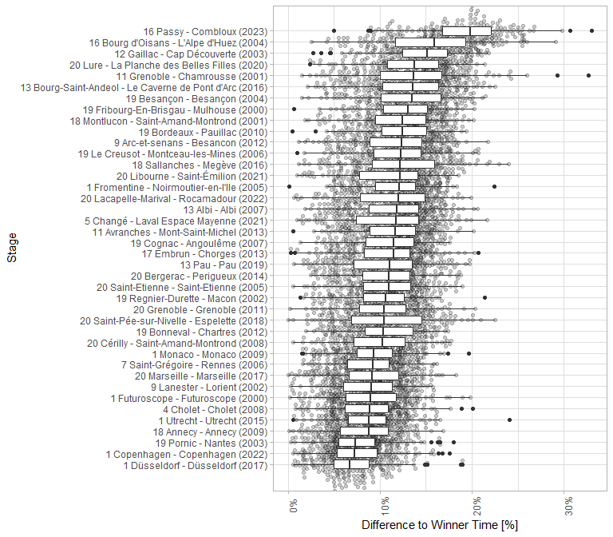

# Idea

In Tour de France history, time trials always are a spectacle of their
own. Oftentimes they are a decisive factor on who wins the general
classification each year. This was also the case this year with a
stunning performance of Jonas Vingegaard on the 16th stage from Passy to
Combloux.

In this post we want to look at the performance of Jonas Vingegaard in
more detail, heavily inspired by this post
[here](https://www.reddit.com/r/peloton/comments/153ys8r/most_dominant_tt_performances_in_the_tdf_since/?utm_source=share&utm_medium=android_app&utm_name=androidcss&utm_term=3&utm_content=share_button).
We will scrape and visualize the data within R using the following
packages:

    library(tarchetypes)
    library(ggbeeswarm)
    library(conflicted)
    library(tidyverse)
    library(distill)
    library(janitor)
    library(targets)
    library(polite)
    library(scales)
    library(rvest)
    library(fs)

    conflict_prefer("filter", "dplyr")

# Data

First we need the raw data. We will get the raw data from
’<https://www.procyclingstats.com/>.

The exact path where we will get the data, is determined by the string
‘race/tour-de-france/’ + the year (up until year 2000) of the Tour de
France edtion:

    tdf_editions <- function(start_year, stages_overview_path) {
      years <- start_year:year(today())
      
      tibble(
        year = start_year:year(today()),
        so_path = str_glue("{stages_overview_path}{year}"))
    }

    ## # A tibble: 24 × 2
    ##     year so_path                 
    ##    <int> <glue>                  
    ##  1  2000 race/tour-de-france/2000
    ##  2  2001 race/tour-de-france/2001
    ##  3  2002 race/tour-de-france/2002
    ##  4  2003 race/tour-de-france/2003
    ##  5  2004 race/tour-de-france/2004
    ##  6  2005 race/tour-de-france/2005
    ##  7  2006 race/tour-de-france/2006
    ##  8  2007 race/tour-de-france/2007
    ##  9  2008 race/tour-de-france/2008
    ## 10  2009 race/tour-de-france/2009
    ## # ℹ 14 more rows

Scrape the stage overview for each edition by using the following helper
function. After a first introduction (next code chunk) we alter the url
by adding the path from the above code chunk. We do this by applying the
`polite::nod` function. After the exact url is determined, we scrape the
content of the webpage using the `polite::scrape` function.

Keep only certain elements of the scraped html by looking for CSS
‘.basic a:nth-child(1)’. The CSS was determined using techniques
described in this
[vignette](https://rvest.tidyverse.org/articles/selectorgadget.html).

    scrape_overview <- function(session_bow, so_path, stages_urls_css) {
      scrape_url <- nod(session_bow, path = so_path)
      
      stages_overview_html <- scrape(scrape_url)
      
      stages_overview_nodes <- stages_overview_html |>
        html_elements(stages_urls_css)
      
      tibble(
        href = html_attr(stages_overview_nodes, "href"),
        desc = html_text(stages_overview_nodes)) |>
        mutate(url = scrape_url$url)
    }

Before we apply this function multiple times, we first introduce
ourselves with the `polite::bow` function. After that we apply the above
function to each edition. By doing this we automatically apply to the
scraping restrictions defined in `robots.txt`.

    stages_overview_raw <- function(cycling_stats_url, so_paths, stages_urls_css) {
      session_bow <- bow(cycling_stats_url)
      
      map_df(so_paths, \(x) scrape_overview(session_bow, x, stages_urls_css))
    }

The result looks like this:

    ## # A tibble: 513 × 5
    ##    href                              desc    url_stages_overview  year url_stage
    ##    <chr>                             <chr>   <chr>               <int> <glue>   
    ##  1 race/tour-de-france/2000/stage-1  Stage … https://www.procyc…  2000 https://…
    ##  2 race/tour-de-france/2000/stage-2  Stage … https://www.procyc…  2000 https://…
    ##  3 race/tour-de-france/2000/stage-3  Stage … https://www.procyc…  2000 https://…
    ##  4 race/tour-de-france/2000/stage-4  Stage … https://www.procyc…  2000 https://…
    ##  5 race/tour-de-france/2000/stage-5  Stage … https://www.procyc…  2000 https://…
    ##  6 race/tour-de-france/2000/stage-6  Stage … https://www.procyc…  2000 https://…
    ##  7 race/tour-de-france/2000/stage-7  Stage … https://www.procyc…  2000 https://…
    ##  8 race/tour-de-france/2000/stage-8  Stage … https://www.procyc…  2000 https://…
    ##  9 race/tour-de-france/2000/stage-9  Stage … https://www.procyc…  2000 https://…
    ## 10 race/tour-de-france/2000/stage-10 Stage … https://www.procyc…  2000 https://…
    ## # ℹ 503 more rows

Preprocess stages overview. Only keep rows with description and extract
year of the edition from `href`:

    stages_overview <- function(df_stages_overview_raw, cycling_stats_url) {
      df_stages_overview_raw |>
        filter(desc != "") |>
        rename(url_stages_overview = url) |>
        mutate(
          year = parse_integer(map_chr(str_split(href, "/"), 3)),
          url_stage = str_glue("{cycling_stats_url}{href}"))
    }

Filter for time trial stages. Keep only rows containing the following
key word to do so:

    ## [1] "\\(ITT\\)"

After filtering, further process the description to keep the string
short and simple:

    stages_itt <- function(df_stages_overview, time_trial_regex) {
      df_stages_overview |>
        filter(str_detect(desc, time_trial_regex)) |>
        distinct(href, .keep_all = TRUE) |>
        mutate(
          desc = str_remove_all(desc, str_glue("{time_trial_regex}|Stage|\\|")),
          desc = str_squish(desc),
          desc = str_glue("{desc} ({year})"))
    }

    ## # A tibble: 40 × 5
    ##    href                              desc    url_stages_overview  year url_stage
    ##    <chr>                             <glue>  <chr>               <int> <glue>   
    ##  1 race/tour-de-france/2000/stage-1  1 Futu… https://www.procyc…  2000 https://…
    ##  2 race/tour-de-france/2000/stage-19 19 Fri… https://www.procyc…  2000 https://…
    ##  3 race/tour-de-france/2001/stage-11 11 Gre… https://www.procyc…  2001 https://…
    ##  4 race/tour-de-france/2001/stage-18 18 Mon… https://www.procyc…  2001 https://…
    ##  5 race/tour-de-france/2002/stage-9  9 Lane… https://www.procyc…  2002 https://…
    ##  6 race/tour-de-france/2002/stage-19 19 Reg… https://www.procyc…  2002 https://…
    ##  7 race/tour-de-france/2003/stage-12 12 Gai… https://www.procyc…  2003 https://…
    ##  8 race/tour-de-france/2003/stage-19 19 Por… https://www.procyc…  2003 https://…
    ##  9 race/tour-de-france/2004/stage-16 16 Bou… https://www.procyc…  2004 https://…
    ## 10 race/tour-de-france/2004/stage-19 19 Bes… https://www.procyc…  2004 https://…
    ## # ℹ 30 more rows

For every time trial, scrape the result of the stage. Use the following
helper function. In the scraped html look for the CSS defined by
‘div.result-cont:nth-child(5) &gt; div:nth-child(1) &gt;
table:nth-child(1)’.

    scrape_stage <- function(session_bow, stage_path, stage_tbl_css) {
      stage_url <- nod(session_bow, path = stage_path)
      
      stage_html <- scrape(stage_url)
      
      html_nodes(stage_html, stage_tbl_css) |>
        html_table() |>
        first() |>
        clean_names() |>
        mutate(rnk = row_number(), url_stage = stage_url$url)
    }

Again, first `bow` to the host and then apply the function from the
above code chunk repeatedly.

    stage <- function(cycling_stats_url, stages_paths, stage_tbl_css) {
      session_bow <- bow(cycling_stats_url)
      
      map_df(stages_paths, \(x) scrape_stage(session_bow, x, stage_tbl_css))
    }

    ## # A tibble: 6,569 × 15
    ##      rnk    gc timelag   bib h2h   specialty rider   age team    uci   pnt x    
    ##    <int> <int> <chr>   <int> <lgl> <chr>     <chr> <int> <chr> <int> <int> <lgl>
    ##  1     1     1 +0:00     127 NA    TT        MILL…    23 Cofi…    NA   100 NA   
    ##  2     2     2 +0:02       1 NA    TT        ARMS…    28 US P…    NA    NA NA   
    ##  3     3     3 +0:13      51 NA    Sprint    JALA…    31 O.N.…    NA    50 NA   
    ##  4     4     4 +0:14      61 NA    TT        ULLR…    26 Team…    NA    40 NA   
    ##  5     5     5 +0:17      52 NA    GC        CAÑA…    25 O.N.…    NA    32 NA   
    ##  6     6     6 +0:20      11 NA    TT        ZÜLL…    31 Bane…    NA    26 NA   
    ##  7     7     7 +0:21       3 NA    TT        EKIM…    34 US P…    NA    22 NA   
    ##  8     8     8 +0:27      72 NA    Classic   BORG…    31 Merc…    NA    18 NA   
    ##  9     9     9 +0:33       4 NA    TT        HAMI…    29 US P…    NA    14 NA   
    ## 10    10    10 +0:36      43 NA    TT        DEKK…    29 Rabo…    NA    10 NA   
    ## # ℹ 6,559 more rows
    ## # ℹ 3 more variables: time <chr>, avg <dbl>, url_stage <chr>

Calculate time delta to winner time for each rider:

    time_delta <- function(df_stage) {
      df_stage |>
        transmute(
          url_stage, rider,
          time_delta = case_when(
            rnk == 1 ~ seconds(0),
            str_detect(time, ",") ~ ms(str_remove_all(time, ",")),
            TRUE ~ ms(str_sub(time, start = (str_length(time) / 2) + 1)))) |>
        filter(!is.na(time_delta))
    }

    ## # A tibble: 6,548 × 3
    ##    url_stage                                                    rider time_delta
    ##    <chr>                                                        <chr> <Period>  
    ##  1 https://www.procyclingstats.com/race/tour-de-france/2000/st… MILL… 0S        
    ##  2 https://www.procyclingstats.com/race/tour-de-france/2000/st… ARMS… 2S        
    ##  3 https://www.procyclingstats.com/race/tour-de-france/2000/st… JALA… 13S       
    ##  4 https://www.procyclingstats.com/race/tour-de-france/2000/st… ULLR… 14S       
    ##  5 https://www.procyclingstats.com/race/tour-de-france/2000/st… CAÑA… 16S       
    ##  6 https://www.procyclingstats.com/race/tour-de-france/2000/st… ZÜLL… 20S       
    ##  7 https://www.procyclingstats.com/race/tour-de-france/2000/st… EKIM… 21S       
    ##  8 https://www.procyclingstats.com/race/tour-de-france/2000/st… BORG… 27S       
    ##  9 https://www.procyclingstats.com/race/tour-de-france/2000/st… HAMI… 33S       
    ## 10 https://www.procyclingstats.com/race/tour-de-france/2000/st… DEKK… 36S       
    ## # ℹ 6,538 more rows

Extract time for each winner:

    winner_time <- function(df_stage) {
      df_stage |>
        group_by(url_stage) |>
        summarise(winner_time = time[rnk == 1]) |>
        mutate(winner_time = hms(winner_time))
    }

# Analysis

Combine everything into one data frame. Calculate total time for each
rider:

    total_time <- function(df_time_delta, df_winner_time, df_stages_itt) {
      df_time_delta |>
        inner_join(df_winner_time, by = "url_stage") |>
        transmute(
          url_stage, rider,
          time = winner_time + time_delta,
          diff_winner_perc = (time - winner_time) / winner_time) |>
        left_join(df_stages_itt, by = "url_stage")
    }

Summarise data per stage. Use this summary to arrange the description as
an ordered factor. Exclude winner rows from the data:

    total_time_summary <- function(df_total_time) {
      df_total_time_summary <- df_total_time |>
        filter(diff_winner_perc != 0) |>
        group_by(desc) |>
        summarise(median_diff_winner_perc = median(diff_winner_perc)) |>
        arrange(desc(median_diff_winner_perc)) |>
        mutate(desc = fct_inorder(desc))
      
      df_total_time |>
        filter(diff_winner_perc != 0) |>
        mutate(desc = fct_rev(factor(desc, df_total_time_summary$desc)))
    }

Visualize data. Arrange the stages based on the summary calculated in
the preceding code chunk:

    vis_total_time <- function(df_total_time_summary) {
      df_total_time_summary |>
        ggplot(aes(y = desc, x = diff_winner_perc)) +
        geom_beeswarm(alpha = 0.2) +
        geom_boxplot() +
        theme_light() +
        theme(axis.text.x = element_text(angle = 90)) +
        scale_x_continuous(labels = label_percent()) +
        labs(y = "Stage", x = "Difference to Winner Time [%]")
    }

The top stages are almost all (except for `Cap Découverte`) mountain
time trials. One can see that this years time trial stands out from the
rest nonetheless!
